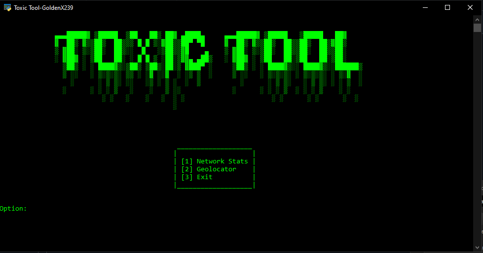

# ToxicTool
**This is a simple Multi-tool with a geolocation and network statistics feature.**
## Take A Look!

## How to run
**First run:**
`pip install requests`
**Next to actually run the program, go to the folder where you downloaded the code and open a cmd there.**
**Then run the code:**
`ToxicTool.py`
## Reminders!
**Make sure you have python installed!**
